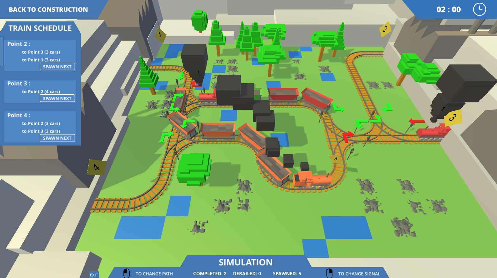

# Rails and Rails

Rails and Rails is a game where players are tasked with building optimal railroads and directing trains efficiently from point A to point B. Players earn higher ratings on each level by minimizing construction costs, avoiding train collisions and derailments, and completing each scenario with fast times.

## How to Play

Players can complete the game's levels in any order that they would like. In each level, the player constructs a railroad network connecting each point with the aim of routing all trains in the train schedule to their appropriate destination. Each level is split into two parts: construction and simulation.

### Construction

-   Each level contains a number of single-tracked points where trains enter and leave the map through. These are numbered from 1 onwards and are indicated on the map by diamonds.
-   The Train Schedule lists the trains departing from each point and their desired destination, in the order that they will appear from the point.
-   Players construct routes between the points using the 9 track sections available. These tracks can be rotated using (R).
-   Tracks can only be placed on empty grass tiles (green). Rocks and trees must be removed using the demolish/bulldozer (Q) before construction.

### Simulation

-   The player now directs trains from their starting points to their destination points. Players allow trains to enter by clicking "Spawn Next" within the Train Schedule.
-   Once spawned, trains will follow the path dictated by the track signals, only stopping at red signals.
-   Left-clicking arrows above the tracks will change the track direction.
-   Right-clicking arrows will change the signal state (green = all clear, red = stop).
-   The simulation can be stopped by clicking "Back to Construction". This allows them to edit the track layout or restart the simulation from the start.

## Credits

The development and 3D modeling was independently done by me. This project uses the [Modern UI Pack by MICHSKY](https://assetstore.unity.com/packages/tools/gui/modern-ui-pack-201717) and mouse icons from [The Noun Project](https://thenounproject.com/). Sound effects are from [freesound](https://freesound.org/).